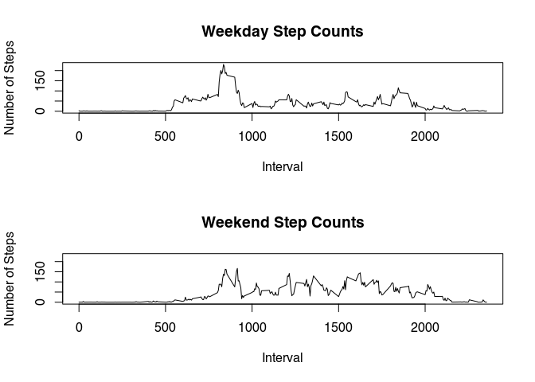
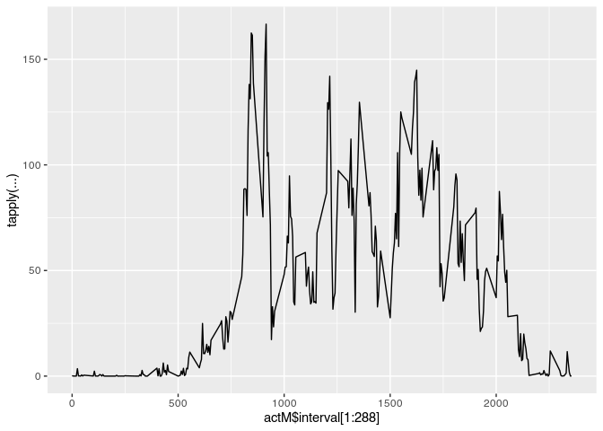

## Loading and preprocessing the data
Unzip the included zip file, which extracts a csv file. Then read the csv file

```r
# load data
filenames <- unzip("activity.zip")
act <- read.csv(filenames)

# preprocess data
# daily total steps, na.rm=TRUE
# act$daily <- rep(tapply(act$steps, act$date, sum, na.rm=TRUE), each=288)
```

## What is mean total number of steps taken per day?

```r
library(ggplot2)
dailyTot <- tapply(act$steps, act$date, sum, na.rm=TRUE)
qplot(dailyTot, main="Daily Total Number of Steps", xlab="Steps")
```

```
## `stat_bin()` using `bins = 30`. Pick better value with `binwidth`.
```

<!-- -->

```r
summary(dailyTot)
```

```
##    Min. 1st Qu.  Median    Mean 3rd Qu.    Max. 
##       0    6778   10395    9354   12811   21194
```
The mean total number of steps per day is 9354 steps, and the median is 10395.

## What is the average daily activity pattern?

```r
dailyAvg <- tapply(act$steps, act$interval, mean, na.rm=TRUE)
qplot(act$interval[1:288], dailyAvg, geom="line", main="Daily Mean Number of Steps", xlab="Interval", ylab="Mean # of Steps")
```

<!-- -->


## Imputing missing values

```r
sum(is.na(act$steps))
```

```
## [1] 2304
```

```r
sum(is.na(act$date))
```

```
## [1] 0
```

```r
sum(is.na(act$interval))
```

```
## [1] 0
```


## Are there differences in activity patterns between weekdays and weekends?

```r
# use the dataset with the filled-in missing values for this part
act$dayOfWeek <- sapply(lapply(act$date, as.Date), weekdays)
act$isWeekday <- factor(act$dayOfWeek %in% c("Saturday", "Sunday"), labels = c("weekday", "weekend"))
tapply(subset(act, isWeekday=="weekday")$steps, subset(act, isWeekday=="weekday")$interval, mean, na.rm=TRUE)
```

```
##           0           5          10          15          20          25 
##   2.3333333   0.4615385   0.1794872   0.2051282   0.1025641   1.5128205 
##          30          35          40          45          50          55 
##   0.7179487   1.1794872   0.0000000   1.8461538   0.4102564   0.0000000 
##         100         105         110         115         120         125 
##   0.4358974   0.0000000   0.2051282   0.4615385   0.0000000   1.5128205 
##         130         135         140         145         150         155 
##   2.2820513   0.0000000   0.2307692   0.2307692   0.3589744   0.0000000 
##         200         205         210         215         220         225 
##   0.0000000   0.0000000   1.4358974   0.0000000   0.0000000   0.1794872 
##         230         235         240         245         250         255 
##   0.0000000   0.3076923   0.0000000   0.0000000   2.1025641   1.2820513 
##         300         305         310         315         320         325 
##   0.0000000   0.0000000   0.0000000   0.0000000   0.0000000   0.8461538 
##         330         335         340         345         350         355 
##   1.1794872   0.5128205   0.4102564   0.1025641   0.0000000   0.0000000 
##         400         405         410         415         420         425 
##   0.1282051   1.2820513   2.1794872   0.0000000   0.4615385   0.0000000 
##         430         435         440         445         450         455 
##   3.2564103   0.1538462   3.8205128   0.8974359   2.2307692   0.6666667 
##         500         505         510         515         520         525 
##   0.0000000   2.1282051   4.0769231   2.1794872   4.3589744   2.6666667 
##         530         535         540         545         550         555 
##   2.8461538   8.2307692  21.0769231  24.4615385  52.0256410  58.0769231 
##         600         605         610         615         620         625 
##  42.7948718  66.9487179  72.5897436  79.2564103  66.0769231  62.0256410 
##         630         635         640         645         650         655 
##  68.6410256  49.3076923  57.4615385  56.5128205  48.5384615  62.1794872 
##         700         705         710         715         720         725 
##  51.6410256  51.8205128  63.7948718  71.6153846  65.1282051  60.3589744 
##         730         735         740         745         750         755 
##  67.8461538  55.8974359  64.3333333  85.5128205  69.2564103  68.1794872 
##         800         805         810         815         820         825 
##  84.1538462  72.5384615 146.2564103 185.7435897 205.1025641 187.9487179 
##         830         835         840         845         850         855 
## 202.2051282 234.1025641 222.4358974 186.5897436 192.4358974 178.6410256 
##         900         905         910         915         920         925 
## 171.3846154 126.0512821  91.6153846  84.1025641 103.5128205  91.9230769 
##         930         935         940         945         950         955 
##  57.3333333  34.4102564  27.8717949  41.1794872  39.7692308  17.1025641 
##        1000        1005        1010        1015        1020        1025 
##  37.4615385  16.8717949  38.5641026  47.0769231  29.0256410  32.7435897 
##        1030        1035        1040        1045        1050        1055 
##  31.4102564  22.2307692  21.7948718  25.5384615  21.5641026  21.9230769 
##        1100        1105        1110        1115        1120        1125 
##  20.2051282  24.3846154  10.2051282  14.8461538  23.5384615  23.3076923 
##        1130        1135        1140        1145        1150        1155 
##  32.6666667  50.2307692  44.9487179  48.4358974  50.7435897  55.6666667 
##        1200        1205        1210        1215        1220        1225 
##  54.4615385  70.5641026  81.9230769  72.5897436  46.4615385  46.3076923 
##        1230        1235        1240        1245        1250        1255 
##  63.8205128  30.4871795  21.2820513  28.0256410  30.8974359  54.9487179 
##        1300        1305        1310        1315        1320        1325 
##  21.8717949  23.5641026  21.6923077  11.7435897  34.0000000  43.0769231 
##        1330        1335        1340        1345        1350        1355 
##  30.0769231  23.0256410  22.9743590  38.1282051  22.2307692  32.5641026 
##        1400        1405        1410        1415        1420        1425 
##  45.5641026  37.6410256  30.3589744  44.4871795  26.2564103  29.7179487 
##        1430        1435        1440        1445        1450        1455 
##  29.8974359  12.5128205  10.6923077  21.3589744  41.5897436  37.4358974 
##        1500        1505        1510        1515        1520        1525 
##  31.0000000  34.8974359  29.1025641  30.8461538  38.9230769  35.7435897 
##        1530        1535        1540        1545        1550        1555 
##  41.2051282  48.7179487  91.7435897  95.4358974  92.6923077  68.2051282 
##        1600        1605        1610        1615        1620        1625 
##  44.5384615  42.2820513  53.8461538  31.9743590  22.1794872  24.8717949 
##        1630        1635        1640        1645        1650        1655 
##  19.2307692  19.2564103  22.9743590  29.9230769  24.7692308  30.6923077 
##        1700        1705        1710        1715        1720        1725 
##  20.0256410  43.2051282  31.6410256  46.0512821  58.1794872  71.3589744 
##        1730        1735        1740        1745        1750        1755 
##  54.1794872  66.7692308  84.0769231  59.7692308  34.4615385  37.6153846 
##        1800        1805        1810        1815        1820        1825 
##  24.4871795  44.8717949  66.0769231  82.2307692  61.7179487  74.3333333 
##        1830        1835        1840        1845        1850        1855 
##  79.4615385  82.6153846  92.6923077 117.9230769 103.5641026  91.3589744 
##        1900        1905        1910        1915        1920        1925 
##  87.9743590  77.1282051  63.0512821  54.5384615  38.1282051  20.5384615 
##        1930        1935        1940        1945        1950        1955 
##  29.3589744  46.8974359  30.0256410  17.5128205  44.0512821  26.3333333 
##        2000        2005        2010        2015        2020        2025 
##  12.4358974   3.4871795   4.8974359  11.1538462   5.9230769   3.3333333 
##        2030        2035        2040        2045        2050        2055 
##   7.0769231   4.9743590   7.3333333  11.8461538  25.0000000  16.8717949 
##        2100        2105        2110        2115        2120        2125 
##  10.6666667  19.1538462  29.2820513  18.8974359  14.5641026   8.0512821 
##        2130        2135        2140        2145        2150        2155 
##  12.5128205  16.5384615   6.8974359   7.5641026   8.2820513   3.5641026 
##        2200        2205        2210        2215        2220        2225 
##   1.5384615   4.5384615   6.5384615  11.5641026   9.6153846  11.1794872 
##        2230        2235        2240        2245        2250        2255 
##  13.2564103   3.0000000   0.0000000   0.1538462   1.9487179   1.6153846 
##        2300        2305        2310        2315        2320        2325 
##   3.5897436   3.8717949   0.0000000   1.1282051   1.3076923   1.9230769 
##        2330        2335        2340        2345        2350        2355 
##   3.1025641   1.8717949   2.0769231   0.2051282   0.3076923   1.4615385
```

```r
qplot(act$interval[1:288], tapply(subset(act, isWeekday=="weekday")$steps, subset(act, isWeekday=="weekday")$interval, mean, na.rm=TRUE), geom="line")
```

<!-- -->

```r
qplot(act$interval[1:288], tapply(subset(act, isWeekday=="weekend")$steps, subset(act, isWeekday=="weekend")$interval, mean, na.rm=TRUE), geom="line")
```

<!-- -->
