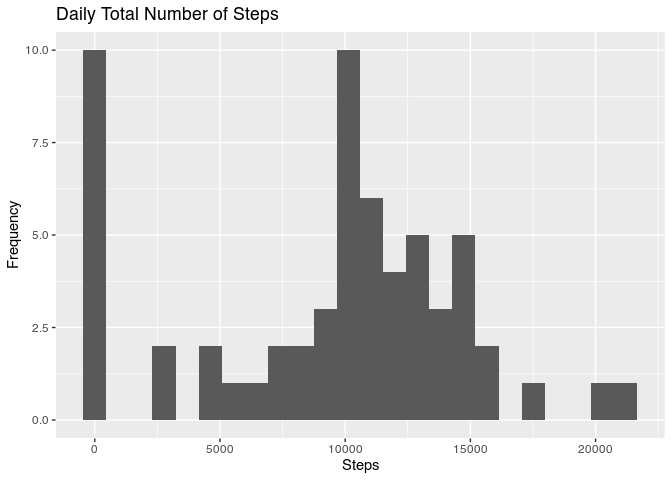
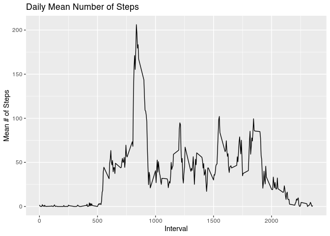

## Loading and preprocessing the data
Unzip the included zip file, which extracts a csv file. Then read the csv file

```r
# load data
filenames <- unzip("activity.zip")
act <- read.csv(filenames)

# preprocess data
# daily total steps, na.rm=TRUE
# act$daily <- rep(tapply(act$steps, act$date, sum, na.rm=TRUE), each=288)
```

## What is mean total number of steps taken per day?

```r
library(ggplot2)
dailyTot <- tapply(act$steps, act$date, sum, na.rm=TRUE)
qplot(dailyTot, main="Daily Total Number of Steps", xlab="Steps")
```

```
## `stat_bin()` using `bins = 30`. Pick better value with `binwidth`.
```

<!-- -->

```r
summary(dailyTot)
```

```
##    Min. 1st Qu.  Median    Mean 3rd Qu.    Max. 
##       0    6778   10395    9354   12811   21194
```
The mean total number of steps per day is 9354 steps, and the median is 10395.

## What is the average daily activity pattern?

```r
dailyAvg <- tapply(act$steps, act$interval, mean, na.rm=TRUE)
qplot(act$interval[1:288], dailyAvg, geom="line", main="Daily Mean Number of Steps", xlab="Interval", ylab="Mean # of Steps")
```

<!-- -->


## Imputing missing values

```r
sum(is.na(act$steps))
```

```
## [1] 2304
```

```r
sum(is.na(act$date))
```

```
## [1] 0
```

```r
sum(is.na(act$interval))
```

```
## [1] 0
```


## Are there differences in activity patterns between weekdays and weekends?

```r
# use the dataset with the filled-in missing values for this part
act$dayOfWeek <- sapply(lapply(act$date, as.Date), weekdays)
act$isWeekday <- factor(act$dayOfWeek %in% c("Saturday", "Sunday"), labels = c("weekday", "weekend"))

# needs to be a panel plot
qplot(act$interval[1:288], tapply(subset(act, isWeekday=="weekday")$steps, subset(act, isWeekday=="weekday")$interval, mean, na.rm=TRUE), geom="line")
```

<!-- -->

```r
qplot(act$interval[1:288], tapply(subset(act, isWeekday=="weekend")$steps, subset(act, isWeekday=="weekend")$interval, mean, na.rm=TRUE), geom="line")
```

<!-- -->
